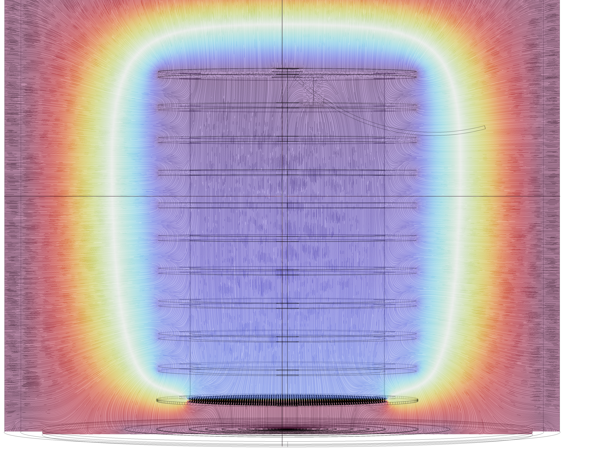
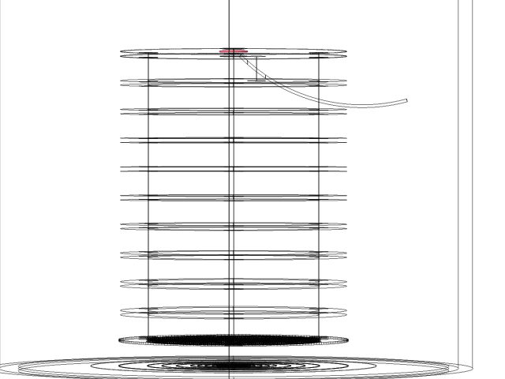
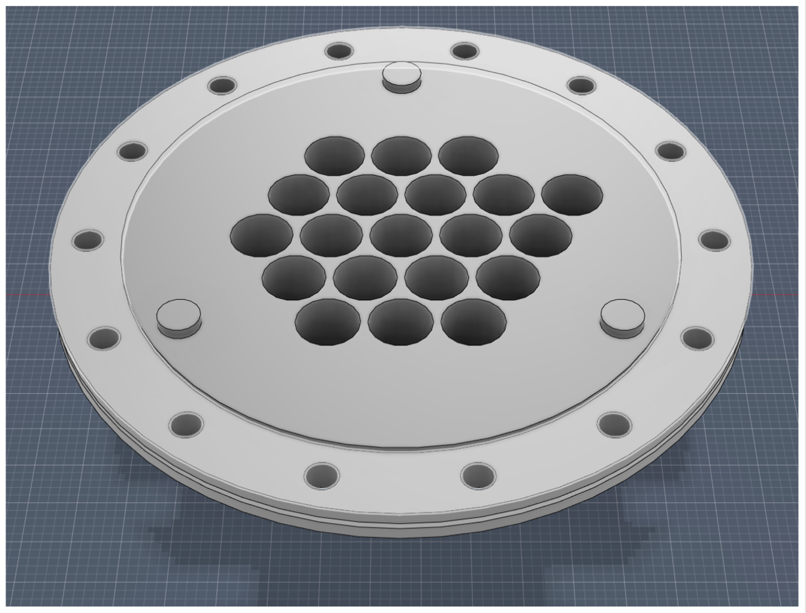
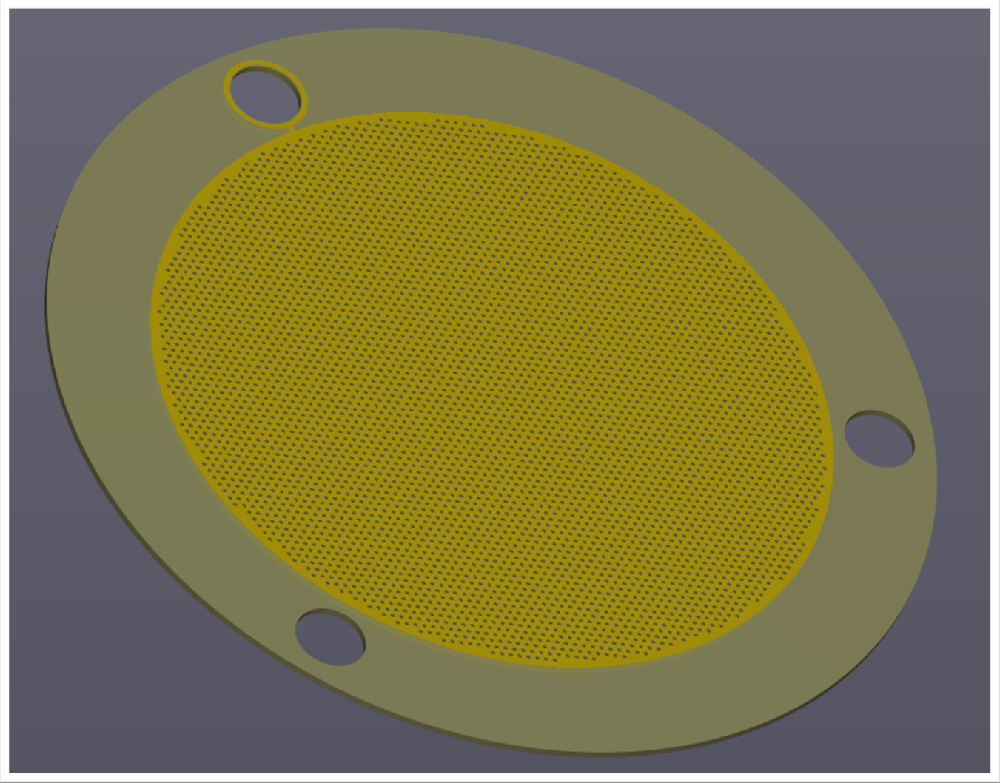

::: **Education :** Senior at **[UTA](https://www.uta.edu/)** for Bachelors' Degree in Physics with a Minor in Mathematics (Dec 2024)  
::: **Employment :** Department of Physics at the University of Texas at Arlington  
::: **Position :** Undergraduate Research Assistant (July 2020)  
::: **Current Advisor :** **[Jonathan Asaadi](https://www.jonathanasaadi.com/)**  
::: **Languages :** English (Primary-Fluent) : Spanish (Secondary-Fluent)
  
:::  **Key Skills** ::: 
- Active Problem Solving  
- Attention to Detail  
- Data Aquisition and Analysis  
- Innovative and Critical Thinking   
- Organization   
- Opportunity Assesment
- Adaptive Learning  
- Circuit Assemblance   
- Mechanical Assembling  
- CAD Modeling  

::: Research Contributions :::  
https://arxiv.org/abs/2402.05734

:::  **Current Programs Used in Labor**  :::  
 ::: https://www.kicad.org/  
 Autodesk Fusion360 ::: https://www.autodesk.com/  
 ::: https://www.comsol.com/  
  Office 365   
  
  

### Photo Showcase of Projects  
     
  
### Projects  
The pinned objects on this page are my projects  
