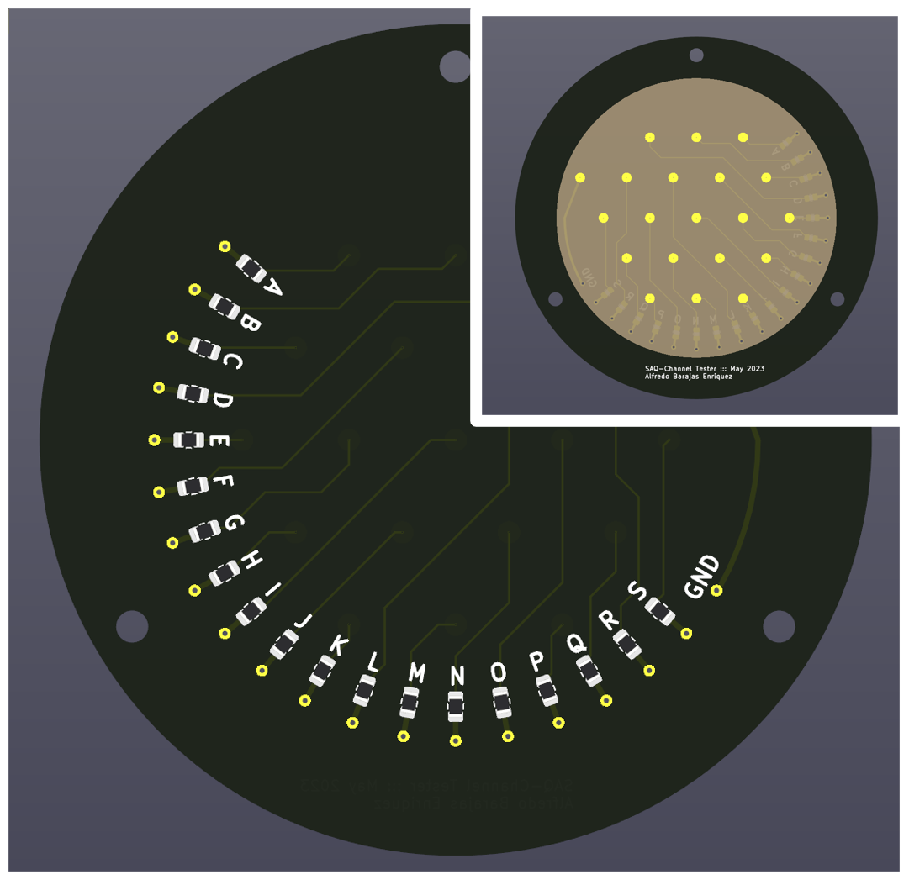
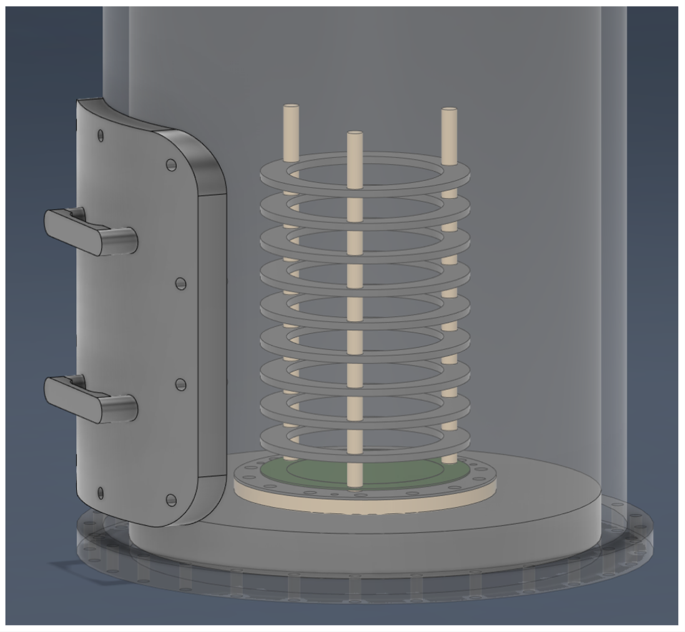

# Alfredo Barajas Enriquez  
  
----------
## About Me  
  
----------
### ::: Basic Information :::  
Education: Senior at **[UTA](https://www.uta.edu/):**  
Employment: Department of Physics at the University of Texas at Arlington  
Position: Undergraduate Research Assistant  
  
 Linked in Account :    
  
  
### ::: Labor and Skills :::  

1. **Behavioral Labor Skills**  
- Active Problem Solving  
- Attention to Detail  
- Data Aquisition and Analysis  
- Innovative and Critical Thinking   
- Organization  

2. **Physical Labor Skills**  
- Soldering  
- Mechanical Assembling  

3. **Digital Program Skills**  
 KiCAD  
 Autodesk Fusion360  
  Word, Excel, and Powerpoint  
  
**Other Skills**  
Organization
## A little more about me and my thoughts
👋 Hello! I am currently studying for a **Bachelors' Degree in Physics with a Minor in Mathematics** Instruments in fields have always been an eye catcher to me, working in any field that allows me to create tools that can facilitate production, efficiency, or any tasks is something that I constantly think on. 
- Is what I am doing the most efficient (?)  
Likely not, feedback is something I value as I can never know if what I truly do is the best. Project direction helps, and if I am asked to attempt a different route experimentally; I will.  
- Is what I create new?  
I wish! A lot of what I craft is made with bits and pieces of what I have observed or it is a simple solution to whatever task I am trying to innovate on.

## Projects
----------  
  
#### Project Showcase  
  
  
  
  
  