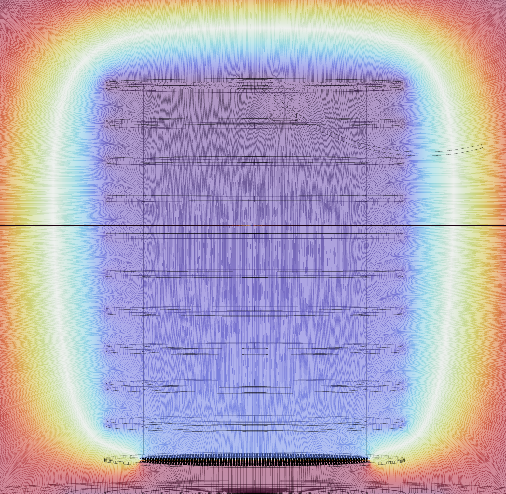

### ::: Basic Information :::  
**Education:** ::: Senior at **[UTA](https://www.uta.edu/)** for Bachelors' Degree in Physics with a Minor in Mathematics  
**Employment:** ::: Department of Physics at the University of Texas at Arlington  
**Position:** ::: Undergraduate Research Assistant  
**Current Advisor:** ::: **[Jonathan Asaadi](https://www.jonathanasaadi.com/)**
  
### Labor Types and Skills 
  
:::  **Key Skills** ::: 
- Active Problem Solving  
- Attention to Detail  
- Data Aquisition and Analysis  
- Innovative and Critical Thinking   
- Organization   
- Opportunity Assesment
- Adaptive Learning  
- Circuit Assemblance   
- Mechanical Assembling  
- CAD Modeling  

:::  **Current Programs Used in Labor**  :::  
 ::: https://www.kicad.org/  
 Autodesk Fusion360 ::: https://www.autodesk.com/  
  Word, Excel, and Powerpoint  
 ::: https://www.comsol.com/  
  
  

## Photo Showcase of Projects  
     
  
The projects showcased are scattered parts of a larger experiment. They are markers of what I have learnt.  
[ThGEM](https://github.com/barajasalfredo13/ThGEM)  
[Comb.SAQ-Pix](https://github.com/barajasalfredo13/Comb.Mod.SAQ.Pix)  
